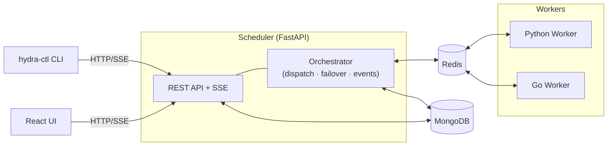

# hydra-jobs

[](LICENSE)
[](https://www.python.org/)
[](https://fastapi.tiangolo.com/)
[](https://react.dev/)
[](https://docs.docker.com/compose/)
[](https://redis.io/)
[](https://www.mongodb.com/)

**Hydra Jobs** is a production-ready distributed job scheduler and runner built for flexibility, multi-tenancy, and scale. It ships a full stack: a FastAPI scheduler, cross-platform Python workers, and a React UI — all wired through Redis and MongoDB.

---

## ✨ Key Features

| Category | Capabilities |
|---|---|
| **Executors** | `shell`, `python`, `batch`, `powershell`, `sql` (Postgres/MySQL/MSSQL/Oracle/MongoDB), `http` (REST/webhooks), `external`, `sensor` (poll HTTP/SQL until a condition is met) |
| **Scheduling** | Immediate, cron (with timezone), interval — with optional `start_at`/`end_at` windows |
| **Source Provisioning** | Git clone (PAT auth, sparse checkout), local `copy`, SSH `rsync` |
| **AI Assistance** | Natural-language job generation, run failure analysis, run-diff root-cause diagnosis, and duration prediction via Google Gemini or OpenAI — plus a canned, LLM-free "Investigate" sweep for common ops questions |
| **Multi-Domain** | Full tenant isolation with per-domain tokens and Redis ACL scoping |
| **Affinity** | Route jobs by OS, tags, hostnames, subnets, deployment type, or executor capability |
| **Reliability** | Retries with delay, timeout enforcement, failover requeue, dependency graph (`depends_on`) |
| **Alerting** | On-failure webhooks and SMTP email alerts (domain-scoped credentials) |
| **Security** | Domain-scoped tokens, encrypted credential store, per-domain Redis ACL, Linux user impersonation, Kerberos pre-auth |
| **Observability** | Real-time SSE log streaming, Gantt/concurrency timeline, worker metrics trends, operational event history |
| **Deployment** | Docker Compose (single/multi worker pool), Kubernetes Helm chart, Windows Task Scheduler/Service, Redis Sentinel HA |

---

## Architecture



- **Scheduler** owns orchestration and persistence: dispatches jobs to Redis queues, handles failover, advances cron/interval schedules, and persists run events consumed from Redis into MongoDB.
- **Workers** are Redis-only at runtime: register metadata, heartbeat with rolling metrics (memory/CPU/load), execute jobs, stream logs, and emit lifecycle events — they never connect to MongoDB.
- **MongoDB** stores durable state: `domains`, `job_definitions`, `job_runs`, `credentials`.
- **hydra-ctl** is a standalone API client for operators; it does not connect to Redis or MongoDB.

> See [`docs/architecture.md`](docs/architecture.md) for detailed diagrams covering the job dispatch sequence, state machine, multi-domain security model, failover flow, and worker deployment options.

---

## Quick Start

**Prerequisites:** Docker + Docker Compose

```bash
ADMIN_TOKEN=my_secret docker compose up --build
```

| Service | Address |
|---|---|
| UI | http://localhost:5173 |
| Scheduler API | http://localhost:8000 |
| Redis | localhost:6379 |
| MongoDB | localhost:27017 |

> Set `GEMINI_API_KEY` or `OPENAI_API_KEY` to enable AI features.

---

## Docker Deployment

Beyond the Quick Start above, the compose files support external
infrastructure, custom ports, and multiple worker pools — see `.env.example`
for the full reference.

**Point at external Redis/MongoDB** instead of the bundled containers:
```bash
REDIS_URL=redis://redis.example.com:6379/0 MONGO_URL=mongodb://mongo.example.com:27017 \
  docker compose up --no-deps scheduler ui
```

**Run multiple different worker pools together** (Python + Go, different
tags/domains/concurrency) — the Docker-route equivalent of the Helm chart's
`workers:` list:
```bash
docker compose -f docker-compose.yml -f docker-compose.workers.yml \
  up -d --build --scale worker-python=4 --scale worker-go=8
```
See `docker-compose.workers.yml` for the full pattern, including how to copy
its two example pools to add more (a GPU-tagged pool, a pool on a different
domain, etc).

**Run a single worker pool remotely**, pointed at an existing scheduler —
useful for distributing workers across separate hosts:
```bash
WORKER_FLAVOR=go ./scripts/worker-up.sh          # or WORKER_FLAVOR=python (default)
```

**Separate the scheduler API from the control-plane orchestrator** (scale or
restart each independently):
```bash
docker compose -f docker-compose.yml -f docker-compose.separated.yml up --build
```

Redis and MongoDB both persist to named volumes (`redis-data`, `mongo-data`)
by default — `docker compose down -v` to wipe them.

---

## Command-line client

Install the project and its `hydra-ctl` executable with [uv](https://docs.astral.sh/uv/):

```bash
uv sync
```

Point the CLI at a Hydra deployment. `HYDRA_TOKEN` may also be supplied as the
existing `API_TOKEN` variable, and `HYDRA_DOMAIN` may be supplied as `DOMAIN`.

```bash
export HYDRA_API_URL=http://localhost:8000
export HYDRA_TOKEN=my_secret
export HYDRA_DOMAIN=prod

uv run hydra-ctl get jobs
uv run hydra-ctl describe job nightly-report
uv run hydra-ctl run nightly-report --param date=2026-07-22
uv run hydra-ctl logs RUN_ID --follow
```

The resource-oriented commands cover common operator workflows:

```bash
# List jobs, runs, and workers; JSON and YAML are available for scripts.
uv run hydra-ctl get workers
uv run hydra-ctl get runs -o json

# Submit a job definition from YAML or JSON (use -f - for stdin).
uv run hydra-ctl apply -f job.yaml

# Trigger, backfill, stop, and remove work.
uv run hydra-ctl run JOB_NAME --param key=value
uv run hydra-ctl backfill JOB_NAME --from 2026-07-01 --to 2026-07-07
uv run hydra-ctl kill RUN_ID
uv run hydra-ctl delete job JOB_NAME

# Control worker dispatch and inspect cluster health.
uv run hydra-ctl worker state WORKER_ID draining
uv run hydra-ctl worker detach WORKER_ID
uv run hydra-ctl overview pressure -o yaml
```

Global flags (`--api-url`, `--token`, `--domain`, and `--timeout`) override the
environment. Job-taking commands accept either a job ID or an exact job name.

---

## Executors

Jobs declare an `executor` block to choose how they run:

```jsonc
// Shell
{ "type": "shell", "script": "echo hello", "shell": "bash" }

// Python (with isolated venv)
{ "type": "python", "code": "print('hi')", "environment": { "type": "venv", "requirements": ["requests"] } }

// SQL (with row limits and transaction control)
{ "type": "sql", "dialect": "postgres", "credential_ref": "my-db", "query": "SELECT 1", "max_rows": 10000, "autocommit": true }

// HTTP (REST triggers, webhooks, health checks)
{ "type": "http", "method": "POST", "url": "https://api.example.com/trigger", "headers": {"Content-Type": "application/json"}, "body": "{\"key\": \"value\"}", "expected_status": [200, 201] }

// PowerShell (Windows workers)
{ "type": "powershell", "script": "Get-Date" }

// Sensor (poll until a condition is met, then complete)
{ "type": "sensor", "sensor_type": "http", "target": "https://api.example.com/status", "poll_interval_seconds": 30, "expected_status": [200] }
```

All executor types support `env`, `args`, `workdir`, `impersonate_user` (Linux/macOS), and Kerberos pre-auth.

### Workspace Caching

Source workspaces are cached per-worker to avoid repeated git clones and file copies. Configure via:

| Variable | Default | Description |
|---|---|---|
| `WORKER_WORKSPACE_CACHE_DIR` | OS temp dir | Cache root directory |
| `WORKER_WORKSPACE_CACHE_MAX_MB` | `1024` | Max total cache size (MB) |
| `WORKER_WORKSPACE_CACHE_TTL` | `3600` | Cache entry TTL (seconds) |
| `WORKER_WORKSPACE_CACHE_PERSIST` | `true` | Keep cache across restarts |

Per-job cache control via `source.cache`: `"auto"` (default), `"always"`, `"never"`.

### Non-Containerized Execution

When running workers outside Docker (bare-metal, VMs, or custom environments), the
following environment variables let you override paths that are normally guaranteed
by the container image:

| Variable | Default | Description |
|---|---|---|
| `HYDRA_PYTHON_PATH` | `python3` (PATH lookup) | Full path to Python interpreter for `python`/`sql` executors |
| `HYDRA_SHELL_PATH` | `/bin/bash` | Full path to bash for `shell` executor |
| `HYDRA_GIT_PATH` | `git` (PATH lookup) | Full path to git binary for source provisioning |
| `HYDRA_TEMP_DIR` | OS default (`/tmp`) | Scratch directory for executor temp files |

These apply to both the Python and Go workers.  When unset, all paths fall back to
the defaults used inside the Docker container image.

---

## Scheduling

```jsonc
// Run once immediately
{ "mode": "immediate" }

// Cron with timezone
{ "mode": "cron", "cron": "0 9 * * 1-5", "timezone": "America/New_York" }

// Every 30 minutes within a window
{ "mode": "interval", "interval_seconds": 1800, "start_at": "2025-01-01T00:00:00Z", "end_at": "2025-12-31T23:59:59Z" }
```

---

## Source Provisioning

Pull code at runtime before execution — no pre-baked images required:

```jsonc
// Git clone (PAT via stored credential)
{ "protocol": "git", "url": "https://github.com/org/repo.git", "ref": "main", "path": "scripts", "sparse": true, "credential_ref": "gh-pat" }

// Local filesystem copy
{ "protocol": "copy", "url": "/opt/jobs/my-script" }

// SSH rsync from remote host
{ "protocol": "rsync", "url": "deploy@build-server:/releases/latest" }
```

---

## AI Features

### Magic Job Generator
In the UI **New Job** form, describe a job in plain English and get a complete JSON definition — choose between Gemini and OpenAI.

### AI Log Assistant
On any run's log view, pick an analysis mode:
- **Failure Fix** — root-cause and remediation steps
- **Summary** — plain-language run summary
- **Error Extraction** — structured list of errors/warnings
- **Retry Tuning** — recommended retry/timeout settings
- **Custom Question** — ask anything about the logs

### Duration Prediction
`POST /ai/predict_duration` estimates expected runtime from historical run data (median, mean, p90).

### Run Diff Copilot
On a failed run's log view, click **Compare vs Last Success** (next to the AI Log Assistant) to diff this run's
output against the job's most recent successful run and get a grounded diagnosis — `POST /ai/diagnose_regression`
returns a likely cause, confidence level, supporting evidence, a suggested fix, and whether the failure looks
transient, using the diff plus the job's historical p90 duration (from Duration Prediction, above) as evidence
rather than guessing from a single run in isolation.

### Investigate (canned, no AI provider required)
The **Investigate** button in the header opens a set of fixed, whitelisted checks that sweep every job for
things that need attention — recently failed jobs, runs already taking 2x longer than usual, flaky jobs, and
jobs that have never once succeeded (`GET /investigations/`, `GET /investigations/{key}`). These are plain
database queries, not LLM calls: no `GEMINI_API_KEY`/`OPENAI_API_KEY` needed, and results are instant.

---

## Multi-Domain & Security

Hydra Jobs is built for multi-tenant deployments. Each domain is fully isolated:

- **Domain token** (`x-api-key`) required for all non-admin API calls
- **Admin token** (`ADMIN_TOKEN`) grants cross-domain access
- **Redis ACL** per domain: workers are scoped to only their domain's keys and channels
- **Encrypted credential store**: database URIs, PAT tokens, SMTP passwords — all stored encrypted in MongoDB, resolved at dispatch, never returned by the API
- **Linux impersonation**: `executor.impersonate_user` runs jobs as a specific OS user
- **Kerberos**: `executor.kerberos` bootstraps a Kerberos ticket before execution; credential cache is destroyed immediately after the job completes
- **Secret masking**: `connection_uri` and `kerberos.keytab` path are redacted in all job API responses
- **Git PAT hygiene**: personal access tokens are injected only for the clone operation; the remote URL is rewritten to remove credentials before the workspace is cached
- **Secure temp files**: SQL driver scripts are written to mode `0o600` files so connection strings are never world-readable

### Start Workers (Recommended ACL Path)

```bash
# 1. Rotate domain token + worker Redis ACL credentials from Admin UI or:
#    POST /admin/domains/{domain}/redis_acl/rotate

# 2. Launch workers
API_TOKEN=<domain_token> \
DOMAIN=prod \
WORKER_REQUIRE_REDIS_ACL=true \
REDIS_URL=redis://localhost:6379/0 \
REDIS_PASSWORD=<worker_redis_acl_password> \
docker compose -f docker-compose.worker.yml up --build --scale worker=2
```

### Windows Workers — Task Scheduler or Windows Service

On Windows hosts, use the built-in bootstrap module to keep a Hydra worker
alive, supervised either by Task Scheduler (no extra tools) or as a real
Windows Service via [NSSM](https://nssm.cc/) (shows up in `services.msc`,
easier to fold into existing service monitoring):

```powershell
# Validate config first
$env:DOMAIN="prod"; $env:API_TOKEN="<token>"; $env:REDIS_URL="redis://host:6379/0"
python -m worker bootstrap validate

# Option A: Task Scheduler (requires admin)
python -m worker bootstrap install   # register
python -m worker bootstrap run       # start immediately, without waiting for reboot
python -m worker bootstrap remove    # uninstall

# Option B: Windows Service via NSSM (requires admin + nssm.exe on PATH)
nssm install HydraWorker "<path-to-python>" "-m worker bootstrap run"
nssm set HydraWorker AppDirectory <runtime-dir>
nssm start HydraWorker
```

See [`docs/windows-worker-bootstrap.md`](docs/windows-worker-bootstrap.md) for
the complete guide covering both mechanisms, environment variables, service
accounts, and troubleshooting.

---

## Affinity & Routing

Target specific workers using the `affinity` block:

```jsonc
{
  "affinity": {
    "os": ["linux"],
    "tags": ["gpu", "high-mem"],
    "hostnames": ["worker-01"],
    "executor_types": ["python"],
    "deployment_types": ["docker", "scheduler"]
  }
}
```

---

## Reliability

- **Retries** with configurable delay: `max_retries`, `retry_delay_seconds`
- **Timeout** enforcement per job
- **Concurrency control**: `MAX_CONCURRENCY` per worker; `bypass_concurrency` for priority jobs
- **Failover**: scheduler requeues jobs from offline workers automatically
- **Dependency graph**: `depends_on` list; `GET /jobs/{job_id}/graph` returns full upstream/downstream graph
- **Completion criteria**: match on exit codes, stdout/stderr contains/not-contains

---

## Alerts & Webhooks

On terminal job failure:
```jsonc
{
  "on_failure_webhooks": ["https://hooks.example.com/notify"],
  "on_failure_email_to": ["ops@example.com"],
  "on_failure_email_credential_ref": "smtp-creds"
}
```

---

## API Reference

| Group | Endpoints |
|---|---|
| **Jobs** | `GET /jobs/` · `POST /jobs/` · `PUT /jobs/{id}` · `POST /jobs/{id}/run` · `POST /jobs/adhoc` · `POST /jobs/validate` · `GET /jobs/{id}/graph` |
| **Runs & Logs** | `GET /jobs/{id}/runs` · `GET /runs/{id}` · `GET /runs/{id}/stream` (SSE) · `GET /history` |
| **Workers** | `GET /workers/` · `GET /workers/{id}/metrics` · `GET /workers/{id}/timeline` · `GET /workers/{id}/operations` · `POST /workers/{id}/state` |
| **AI** | `POST /ai/generate_job` · `POST /ai/analyze_run` · `POST /ai/predict_duration` · `POST /ai/diagnose_regression` |
| **Investigations** | `GET /investigations/` · `GET /investigations/{key}` |
| **Domain Self-Service** | `GET /domain/settings` · `PUT /domain/settings` · `POST /domain/token/rotate` · `POST /domain/redis_acl/rotate` |
| **Credentials** | `GET /credentials/` · `POST /credentials/` · `PUT /credentials/{name}` · `DELETE /credentials/{name}` |
| **Admin** | `GET /admin/domains` · `POST /admin/domains` · `POST /admin/domains/{domain}/token` · `POST /admin/domains/{domain}/redis_acl/rotate` |

---

## High Availability: Redis Sentinel

```bash
REDIS_SENTINELS=host1:26379,host2:26379
REDIS_SENTINEL_MASTER=mymaster
# Optional
REDIS_SENTINEL_USERNAME=...
REDIS_SENTINEL_PASSWORD=...
```

If Sentinel vars are not set, `REDIS_URL` is used.

---

## Kubernetes

A Helm chart in `deploy/helm/hydra/` deploys the full stack — Redis, MongoDB,
scheduler, one or more worker pools (Python and/or Go), and the UI — with
persistence, health probes, optional Ingress, and multi-domain worker
support. See `deploy/helm/hydra/README.md` for the full home-lab deployment
guide, including how to build and load images onto a cluster without a
registry.

```bash
helm install hydra deploy/helm/hydra -n hydra --create-namespace \
  --set ui.apiBaseUrl=http://localhost:8000
```

---

## Operator Scripts

| Script | Purpose |
|---|---|
| `scripts/dev-up.sh` | Start full dev stack |
| `scripts/provision-redis-acl.sh` | Provision domain worker ACL via scheduler API |
| `scripts/configure-external-redis-acl.sh` | Configure ACL on an external Redis directly |
| `scripts/start-domain-workers.sh <domain> [scale]` | Agentic worker bring-up (Docker/K8s/Bare) |
| `scripts/diagnose-domain-admin.sh <domain>` | Agentic domain + Redis diagnostics |
| `scripts/create-domain.sh` | Create a new domain via the API |

---

## Worker Status

| Dimension | Values |
|---|---|
| `connectivity_status` | `online` \| `offline` (heartbeat-derived) |
| `dispatch_status` | `online` \| `draining` \| `offline` (operator-controlled) |

`POST /workers/{id}/state` accepts `online`, `draining`, `offline` (`disabled` accepted as legacy alias).

---

## UI Highlights

- **Login gate**: unauthenticated users see only the auth screen
- **Operate view**: live job list with inline run/edit/delete
- **Observe view**: run history and real-time status
- **Worker detail**: metrics trends, concurrency Gantt timeline, operational event history
- **Log viewer**: search/highlight, parsed/raw toggle, expand, copy
- **AI assistant**: integrated in log view and job creation form
- **Investigate**: header button for canned, LLM-free checks across all jobs (recently failed, running long, flaky, never succeeded)
- **Dark/light mode** persistent toggle
- **Admin panel**: domain management, credential CRUD, token rotation

---

## Development

```bash
# Install the locked Python environment
uv sync --dev

# Scheduler (hot-reload)
uv run uvicorn scheduler.main:app --reload --host 0.0.0.0 --port 8000

# UI (Vite dev server)
cd ui && npm install && npm run dev

# Backend tests
uv run pytest tests/ --ignore=tests/test_end_to_end.py -v

# UI unit tests
cd ui && npx vitest run

# Cypress e2e (requires UI running)
cd ui && npm run cypress:open   # interactive
cd ui && npm run cypress:run    # headless
```

See also: [`docs/README.md`](docs/README.md), [`docs/development/docker-compose-workflows.md`](docs/development/docker-compose-workflows.md), [`docs/development/testing.md`](docs/development/testing.md)

### Versioning & Releases

Version bumps, `CHANGELOG.md`, and GitHub Releases are generated automatically from
[Conventional Commits](https://www.conventionalcommits.org/) on `main` — see
[`CONTRIBUTING.md`](CONTRIBUTING.md) for the commit format and how the release PR flow works.

---

## Troubleshooting

- **CORS errors**: set `CORS_ALLOW_ORIGINS` (comma-separated or `*`); ensure scheduler is reachable from the UI host.
- **Worker unauthorized/offline**: verify `DOMAIN` + `API_TOKEN`; re-rotate domain token if invalidated; verify `REDIS_PASSWORD` if ACL is required.
- **Storage pressure**: low disk can corrupt MongoDB startup — recover space before restarting, check `docker system df`.

---

## Redis Key Layout

```
job_queue:<domain>:pending
job_queue:<domain>:<worker_id>
workers:<domain>:<worker_id>
worker_heartbeats:<domain>
worker_running_set:<domain>:<worker_id>
job_running:<domain>:<job_id>
worker_metrics:<domain>:<worker_id>:history
run_events:<domain>
worker_ops:<domain>:<worker_id>
log_stream:<domain>:<run_id>*
```

---

## License

[MIT](LICENSE)
